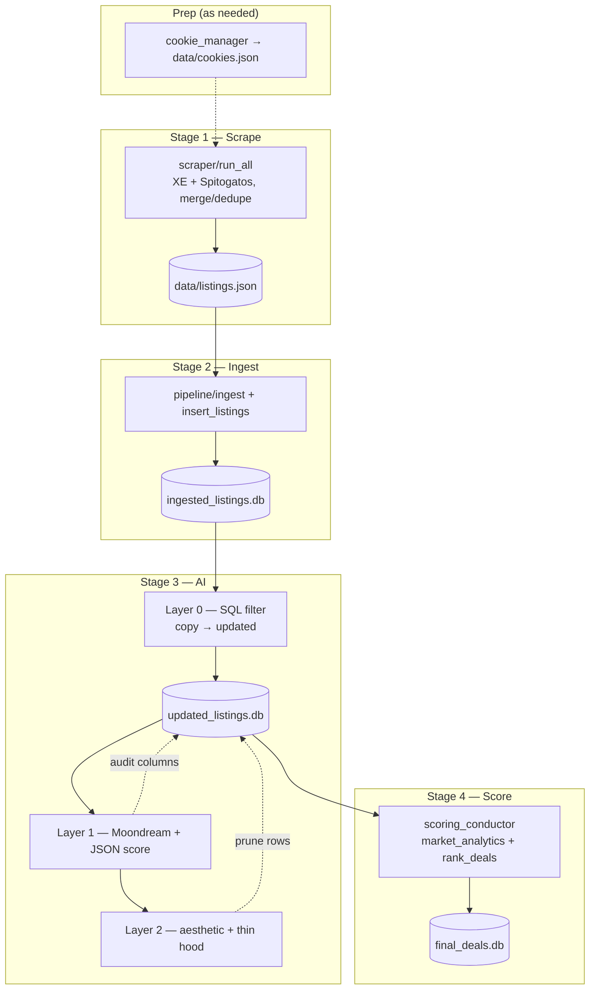
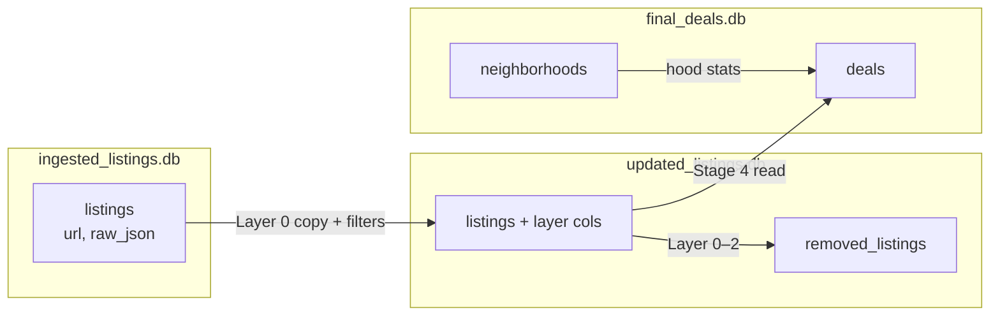

# GreeceApt — Architecture

Pipeline map: **scrape → ingest → AI (layers 0–2) → score**. Entrypoint: `python -m greeceapt.main`. **`--score-only`** runs Stage 4 only (same as `greeceapt.scoring.scoring_conductor`); expects `data/updated_listings.db` from a prior AI run.

**DDL:** tables are defined in `db_helpers/core.py` and `db_helpers/db_conductor.py`. The SQL blocks below are a **readable snapshot**; if they disagree with code, trust the repo.

## Stages

| Stage | Runs | Primary artifact |
|-------|------|------------------|
| **1** | `greeceapt.scraper.run_all` | `data/listings.json` (+ per-site JSON, merge sidecars) |
| **2** | `greeceapt.pipeline.ingest` → `db_helpers.core.insert_listings` | `data/ingested_listings.db` |
| **3** | `greeceapt.ai_agent.ai_conductor.run` | `data/updated_listings.db` |
| **4** | `greeceapt.scoring.scoring_conductor.run` | `data/final_deals.db` |

Ordered steps: cookies (optional) → scrape → ingest → Layer 0 (copy + SQL filters) → Layer 1 (vision) → Layer 2 (gates) → baselines + `rank_deals`.

## Pipeline diagrams

### Overview (Mermaid)



### File-level flow (ASCII)

Stage 1 uses **two subprocesses** (`run_all.py`), then merge.

```
┌─────────────────────────────────────────────────────────┐
│  USER / BROWSER                                         │
│  CAPTCHA / bootstrap when XE flow requires it            │
└────────────────────────┬────────────────────────────────┘
                         ▼
┌─────────────────────────────────────────────────────────┐
│  cookies/cookie_manager.py → data/cookies.json           │
└────────────────────────┬────────────────────────────────┘
                         ▼
┌─────────────────────────────────────────────────────────┐
│  scraper/run_all.py                                     │
│  • python -m greeceapt.scraper.scrape_xe                │
│    → scraper/xe/* (cookies, curl-cffi, APIs)            │
│    → data/xe_listings.json                              │
│  • python -m greeceapt.scraper.scrape_spitogatos        │
│    → data/spitogatos_listings.json                      │
│  • Merge + Quad-Lock dedupe (pHash + metadata)          │
│  → data/listings.json (+ deleted/stale sidecars)        │
└────────────────────────┬────────────────────────────────┘
                         ▼
┌─────────────────────────────────────────────────────────┐
│  pipeline/ingest.py + db_helpers.core.insert_listings   │
│  normalize_listing_url, resolve_neighborhood, upsert     │
│  → data/ingested_listings.db                            │
└────────────────────────┬────────────────────────────────┘
                         ▼
┌─────────────────────────────────────────────────────────┐
│  ai_conductor + layer_0_cleaner                         │
│  Copy ingested → updated; drop: no hood, age > 180d,    │
│  ≤2 photo URLs (need ≥3). Rows → removed_listings.      │
└────────────────────────┬────────────────────────────────┘
                         ▼
┌─────────────────────────────────────────────────────────┐
│  ai_conductor + layer_1_quality_audit (Ollama)          │
│  Download → 384×384 JPEG → Moondream describe →         │
│  OLLAMA_SCORE_MODEL JSON (score, view_type, …)          │
│  visual_score = top-5 interior mean; UPDATE listings.   │
└────────────────────────┬────────────────────────────────┘
                         ▼
┌─────────────────────────────────────────────────────────┐
│  ai_conductor + layer_2_aesthetic_filter                │
│  Drop visual_score < 3.0 or NULL; drop thin hoods       │
│  (< 10 listings). Rows → removed_listings.             │
└────────────────────────┬────────────────────────────────┘
                         ▼
┌─────────────────────────────────────────────────────────┐
│  scoring_conductor + market_analytics                   │
│  Hood PSQM baselines; <10 listings → no baseline row    │
└────────────────────────┬────────────────────────────────┘
                         ▼
┌─────────────────────────────────────────────────────────┐
│  scoring_algorithm.rank_deals                           │
│  45% price + 20% tier + 20% visual + 15% structure      │
│  (renormalize if price baseline missing)                │
│  → data/final_deals.db (deals + neighborhoods)          │
└─────────────────────────────────────────────────────────┘
```

## Stage 3 — layers 0–2

Order is fixed in `ai_conductor.run()`.

| Layer | Role | Code |
|-------|------|------|
| **0** | Copy ingested → `updated_listings.db`; remove missing neighborhood, **>180d** age, **≤2** photos (needs **≥3**). Basement drop belongs here when implemented (`floor` / `xe_parse`). | `ai_agent/layer_0_cleaner.py` |
| **1** | Moondream one-line description + **`OLLAMA_SCORE_MODEL`** JSON → `visual_score`, `layer_1_features`; interior-like views only for aggregation. | `ai_agent/layer_1_quality_audit.py`, `db_conductor` |
| **2** | `visual_score` threshold + purge neighborhoods with **<10** survivors (thin-hood gate). | `ai_agent/layer_2_aesthetic_filter.py` |

## Stage 4 — scoring

| Piece | Role | Code |
|-------|------|------|
| **Baselines** | Per-hood floor-adjusted trimmed-mean normalized PSQM; hoods with **<10** samples → **no** baseline (no tier/muni substitute for price anchor). | `scoring/market_analytics.py`, `scoring_conductor.py` |
| **Rank** | Blend weights; omit price leg + renormalize when baseline missing. | `scoring/scoring_algorithm.rank_deals` |

`rank_deals` is **pure**: receives `sqlite3.Row` from the conductor via `db_conductor`; it must not open DB connections.

## Databases

### Relationships (Mermaid)



### Roles

- **`ingested_listings.db`:** durable listings; upsert on normalized **`url`**; `raw_json` retained.
- **`updated_listings.db`:** rebuilt from ingested each Layer 0 run; adds `layer_1_processed`, `layer_1_features`, Layer 1 **`visual_score`**; **`removed_listings`** with `removal_reason`, `layer_origin`.
- **`final_deals.db`:** **`deals`** (ranked rows); **`neighborhoods`** (counts, median PSQM, tier) for display and logic.

Deals reference surviving listings by identity (`url` / id as written by scoring). Tier drives location score; thin hoods do not get a synthetic PSQM baseline.

**DDL source:** `core.create_tables` (ingested), `db_conductor.setup_layer0_tables` / `_ensure_layer1_columns` / `_ensure_removed_table` (updated), `db_conductor.create_final_schema` (final).

### SQL snapshot — `ingested_listings.db`

From `db_helpers/core.create_tables` (migrations may add columns in the same module).

```sql
CREATE TABLE IF NOT EXISTS listings (
    id INTEGER PRIMARY KEY AUTOINCREMENT,
    url TEXT UNIQUE,
    title TEXT,
    price_eur REAL,
    price_per_sqm REAL,
    area_sqm REAL,
    municipality TEXT,
    neighborhood TEXT,
    address_raw TEXT,
    bedrooms INTEGER,
    bathrooms INTEGER,
    floor INTEGER,
    year_built INTEGER,
    renovation_year INTEGER,
    energy_class TEXT,
    heating_type TEXT,
    photos_count INTEGER,
    photo_urls_json TEXT,
    publication_date TEXT,
    scraped_at TEXT,
    raw_json TEXT,
    updated_at TEXT,
    neighborhood_score INTEGER,
    visual_score REAL,
    source TEXT
);

CREATE TABLE IF NOT EXISTS neighborhoods (
    name          TEXT PRIMARY KEY,
    listing_count INTEGER NOT NULL DEFAULT 0,
    first_seen    TEXT,
    last_seen     TEXT
);

CREATE TABLE IF NOT EXISTS price_history (
    id INTEGER PRIMARY KEY AUTOINCREMENT,
    listing_id INTEGER NOT NULL,
    old_price_eur REAL,
    new_price_eur REAL,
    recorded_at TEXT NOT NULL,
    FOREIGN KEY (listing_id) REFERENCES listings(id)
);
```

### SQL snapshot — `final_deals.db`

From `db_conductor.create_final_schema`.

```sql
CREATE TABLE deals (
    score       REAL,
    hood        TEXT,
    price       INTEGER,
    area        INTEGER,
    market_diff TEXT,
    floor       TEXT,
    visual      REAL,
    url         TEXT
);

CREATE TABLE neighborhoods (
    name          TEXT PRIMARY KEY,
    listing_count INTEGER,
    median_psqm   REAL,
    tier          TEXT
);
```

## Code layout

```
greeceapt/main.py
├── scraper/run_all.py
│   ├── scraper/scrape_xe.py          → scraper/xe/* (run_scrape_cycle)
│   ├── scraper/scrape_spitogatos.py
│   └── scraper/util.py               merge, dedupe, stale handling
├── pipeline/ingest.py
│   └── db_helpers/core.py            insert_listings, ingest schema
├── ai_agent/ai_conductor.py
│   ├── ai_agent/layer_0_cleaner.py       → db_helpers/db_conductor.py
│   ├── ai_agent/layer_1_quality_audit.py (Ollama, Pillow)
│   └── ai_agent/layer_2_aesthetic_filter.py → db_helpers/db_conductor.py
└── scoring/scoring_conductor.py
    ├── scoring/market_analytics.py
    ├── scoring/scoring_algorithm.py  rank_deals (pure; no DB)
    └── db_helpers/db_conductor.py

db_helpers/core.py → db_helpers/util.py (normalize_listing_url, …)
```

## Engineering notes

**Layer 1 throughput:** concurrent downloads + bounded Ollama concurrency (`layer_1_quality_audit.py`, `ai_conductor` env vars) — avoid “one HTTP call per fork” patterns.

**DB access:** scraper / AI / scoring conductors use **`db_conductor`** (or `core` for ingest); **`rank_deals`** must not open SQLite itself.

| Topic | Choice |
|-------|--------|
| Three DBs | Ingested = durable input; updated = per-run scratch; final = regenerated output |
| Ingest | Upsert on normalized `url` |
| Vision | Moondream + JSON scoring model (see `.ai/coding_rules.md`) |
| Baselines | Trimmed mean PSQM, floor-adjusted, **min 10 listings per hood**; missing baseline → price leg omitted, weights renormalized in `rank_deals` |
